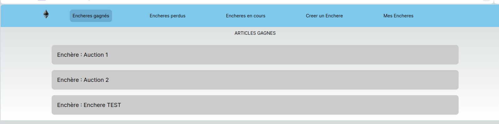

# Application décentralisée d'enchères hollandaises

|       Nom       | Prénom  |
|-----------------|---------|
|   ALONSO TORT   |  Andoni |

Le TP est à réaliser individuellement.

## Présentation

Ce TP est le prolongement du premier et consiste à créer une application décentralisée (dApp) permettant de donner vie à votre Smart Contract (SC). Celle-ci doit pouvoir proposer les fonctionnalités suivantes.

### Authentification et profil

Il doit être possible de se connecter à l'aide de son portefeuille MetaMask. Vous pouvez utiliser la SDK de [MetaMask](https://docs.metamask.io/wallet/how-to/connect/set-up-sdk/).

Les données du portefeuille telles que la clé publique et le solde en ETH doivent être visibles depuis l'application.

### Enchères

La gestion des enchères est composée des éléments suivants :
- Une liste des enchères disponibles ;
- Créer une enchère avec les paramètres souhaités par le propriétaire ;
- Participer à une ou plusieurs enchères ;
- Pouvoir enchérir ;
- Cloturer une enchère (versement des fonds au propriétaire de l'enchère) ;
- Un tableau de bord permettant de visualiser les enchères gagnées, en cours ou perdues.

*N'oubliez pas de créer une barre de navigation pour accéder aux différentes fonctionnalités.*

Pour interagir avec la blockchain depuis votre application, il existe plusieurs bibliothèques telles que [ethers](https://docs.ethers.org/v5/) ou encore [web3js](https://web3js.readthedocs.io/en/v1.10.0/).

## Restitution

**Un rapport concernant l'utilisation de l'application sera à restituer 3 semaines après le dernier TP.**

Pour ce projet, il est imposé d'utiliser le framework [NextJS](https://nextjs.org/) qui utilise la bibliothèque [React](https://react.dev/).

## Installation

Pour créer une application NextJS, utilisez la commande suivante : 
```shell
npx create-next-app@latest
```

A vous de jouer !

## Getting Started

Executer :

```bash
npm run dev
```

Ouvrir [http://localhost:3000](http://localhost:3000) avec votre navigateur pour voir le résultat.


# = ENCHERE HOLLANDAISE APP =

Attention, pour le bon fonctionnement de ce projet il faut déjà avoir installé Metamask sur notre navigateur, les étapes à suivre son expliquées dans le rapport dans l'autre [projet de la forge](https://www-apps.univ-lehavre.fr/forge/aa204303/dutch-auction.git).

## Ganache
Pour qu'on puisse utiliser notre contrat, ne pas oublier de lancer ganache avant et deployer notre contract dans notre notre application sur [le projet de la forge](https://www-apps.univ-lehavre.fr/forge/aa204303/dutch-auction.git).

Juste pour vérifier le fonctionnement, j'ai rajouté deux enchères qui commenceront dès que le contrat est deployé.


## ENV

Veuillez de specifier votre  url ganache avec son port dans un fichier .env, vous pouvez regarder le fichier .env_exemple pour plus des informations.

## Application WEB

Aller sur http://localhost:3000/

On arrive sur la page principal, et là on pourra fournir l'address de notre contrat, puis appuyer sur  "Submit"


La première fois qu'on clique, une fenêtre sera affiche dans le navigateur pour faire un login dans notre compte de Metamask


Reinseignez votre mot de passe.


On aura un message qu'on est connecté a notre contrat, et on verra les differents onglets dans la barre de navigation.


Puis cliquer sur l'onglet de la barre de navigation "Encheres en cours".


Ici on verra deux encheres qui on été lancés lors du deploiment du contrat. On verra à gauche le nom de l'article et le temp écuoulé depuis depuis qu'il a demarré.

Pour les deux encherès le prix descends chaque 50 seconds, jusqu'à arriver à 0.2 eth.

L'arricle disponible sur le moment, fourni un input où on pourra placer une offre selon le prix en temps réel affiché dans l'application. C'est à dire que si on essaie d'acheter le produit pour un prix plus bas de ce qui est affiché, on aura un erreur.


On peut voir que l'on a entre parenteses un texte qui dit (Mon Enchère), cela est parce que les enchères on été crée dans le compte où on est connectés, essayons maintenant de changer de compte Metamast et devenir sur la page "Encheres en cours".


Si on revient sur l'onglet "Encheres en cours" on verra que les enchères qui n'ont pas été crées avec mon compte sont en gris et on n'a plus le texte (Mon Enchere).

Pour créer un enchère dans le compte connecté, aller sur l'onglet "Creer un Enchere".


Ici on a plusieurs champs a remplir : 
    <ul>
        <li><b>Nom de l'enchere:</b> Un string pour nommer notre enchère</li>
        <li><b>Duraction totale:</b> Duration max de l'enchere avant le fermer (temps donné en seconds)</li>
        <li><b>Prix initiale:</b> Le prix initial pour tous les articles au démarrage. Ici on va commencer avec un prix de 2 eth.</li>
        <li><b>Baisse de prix:</b> Combien on veut baisser le prix au fur et à messure que le temps augmente.</li>
        <li><b>Prix minimum des articles:</b> Le prix le plus bas auquel peut arriver un article.</li>
        <li><b>Temps pour descendre le prix:</b> Dans combien de temps le prix sera diminué.</li>
        <li><b>Articles:</b> On peut ajouter autant d'articles qu'on veut, il suffit de cliquer sur le bouton vert "Article +".</li>
        <li><b>Commencer enchère fermé:</b> Si l'on veut pas commencer immédiatement l'enchère, on peut l'initialiser avec un état fermé pour l'ouvrir plus tard.</li>
    </ul>
    

Une fois qu'on a rempli toutes les champs, on peut cliquer sur "Submit" pour créer notre enchère :


On aura un message que l'enchère a été crée.

Si on vient à nouveau à l'onglet "Enchers  en cours" on va s'appercevoir qu'il n'est pas là. Cela est dû à qu'on l'a crée avec un état fermé. On ira donc à l'onglet "Mes Encheres".


Ici on verra que l'enchere est fermé et on a un bouton "Ouvrir l'enchere" pour le commencer.
Le texte "(Ouvert)" dans les articles veut dire qu'ils n'ont pas encore été achetés.

Cliquez sur "Ouvrir l'enchere pour commencer". Une fenêtre sera afficher, confirmez la transaction.


Une fois ouvert on verra que le temps commence a écouler et le prix commence a descendre.

Si on vient à nouveau sur la page "Encheres en cours" on verra que notre nouveau enchère est là.


Maintenant essayons d'accheter un article.


Une fois la transaction completé on verra que l'enchère passe à larticle suivant


Essayons d'accher plusieurs articles, puis aller à l'onglet "Encheres gagnés".


On verra une liste des articles gagnés dans les enchères existants.
Si on bascule sur un autre compte on verra que la liste est vide



Par contre si on vient sur la liste d'encheres perdus, on verra la liste des articles qu'on a pas acheté et qui sont déjà achetés pas un autre compte.


Maintenant si on achete tous les elements d'un enchère on verra qu'il desparaît des "Encheres en cours" et son état devient fermé.
Donc, le créateur de l'enchère, s'il vient sur "Mes encheres"


On verra que tous les articles sont fermés (ont été achetés) et on ne peut plus ouvrir l'enchère.

===========================================================


<h6>Developpé par Andoni ALONSO Tort</h6>
<h6>Université du Havre Normandie, France</h6>