# Enchère Hollandaise COTE WEB

|   Nom           | Prénom   |
|-----------------|----------|
|   Alonso Tort   |  Andoni  |


This is a [Next.js](https://nextjs.org/) project bootstrapped with [`create-next-app`](https://github.com/vercel/next.js/tree/canary/packages/create-next-app).

## Getting Started

First, run the development server:

```bash
npm run dev
# or
yarn dev
# or# Enchère Hollandaise

|   Nom           | Prénom   |
|-----------------|----------|
|   Alonso Tort   |  Andoni  |

pnpm dev
# or
bun dev
```

Open [http://localhost:3000](http://localhost:3000) with your browser to see the result.

You can start editing the page by modifying `app/page.tsx`. The page auto-updates as you edit the file.

This project uses [`next/font`](https://nextjs.org/docs/basic-features/font-optimization) to automatically optimize and load Inter, a custom Google Font.

## Learn More

To learn more about Next.js, take a look at the following resources:

- [Next.js Documentation](https://nextjs.org/docs) - learn about Next.js features and API.
- [Learn Next.js](https://nextjs.org/learn) - an interactive Next.js tutorial.

You can check out [the Next.js GitHub repository](https://github.com/vercel/next.js/) - your feedback and contributions are welcome!

## Deploy on Vercel

The easiest way to deploy your Next.js app is to use the [Vercel Platform](https://vercel.com/new?utm_medium=default-template&filter=next.js&utm_source=create-next-app&utm_campaign=create-next-app-readme) from the creators of Next.js.

Check out our [Next.js deployment documentation](https://nextjs.org/docs/deployment) for more details.


======= ENCHERE HOLLANDAISE APP =======

Attention, pour le bon fonctionnement de ce projet il faut déjà avoir installé Metamask sur notre navigateur, les étapes à suivre son expliquées dans le rapport dans l'autre [projet de la forge](https://www-apps.univ-lehavre.fr/forge/aa204303/dutch-auction.git).

## Ganache
Pour qu'on puisse utiliser notre contrat, ne pas oublier de lancer ganache avant et deployer notre contract dans notre notre application sur [le projet de la forge](https://www-apps.univ-lehavre.fr/forge/aa204303/dutch-auction.git).

L'enchère commencera dès que le contrat est deployé.

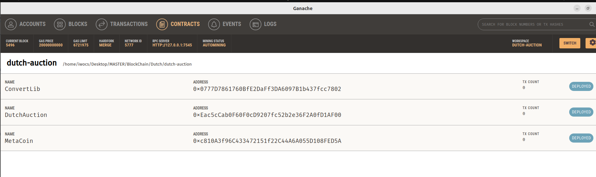

## ABI 
Pour l'Abi de notre contrat il peut etre situé dans le dossier build/contracts/DutchAuction.json dans l'autre [projet](https://www-apps.univ-lehavre.fr/forge/aa204303/dutch-auction.git).

Pour l'application Web, l'Abi à été placé dans app/composants/abi.tsx.

## Application WEB

Lancer l'application avec
```bash
    npm run dev
```

Aller sur http://localhost:3000/dashboard

On arrive sur la page principal, et là on pourra fournir l'address de notre contrat, puis appuyer sur  "Submit"

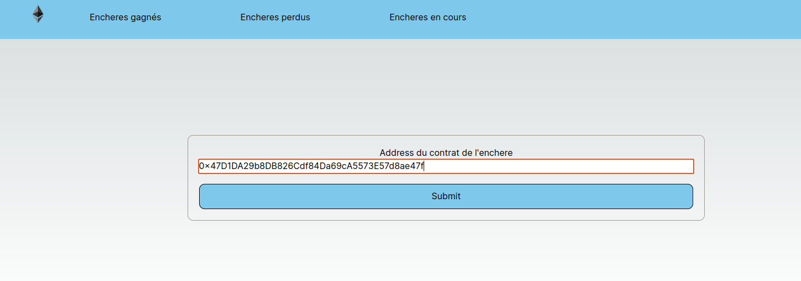

La première fois qu'on clique, une fenêtre sera affiche dans le navigateur pour faire un login dans notre compte de Metamask


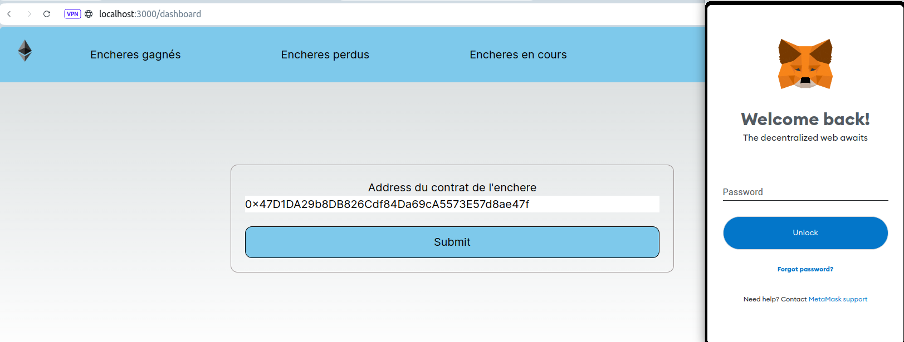

Reinseignez votre mmot de passe et puis cliquer sur l'onglet de la barre de navigation "Encheres en cours".


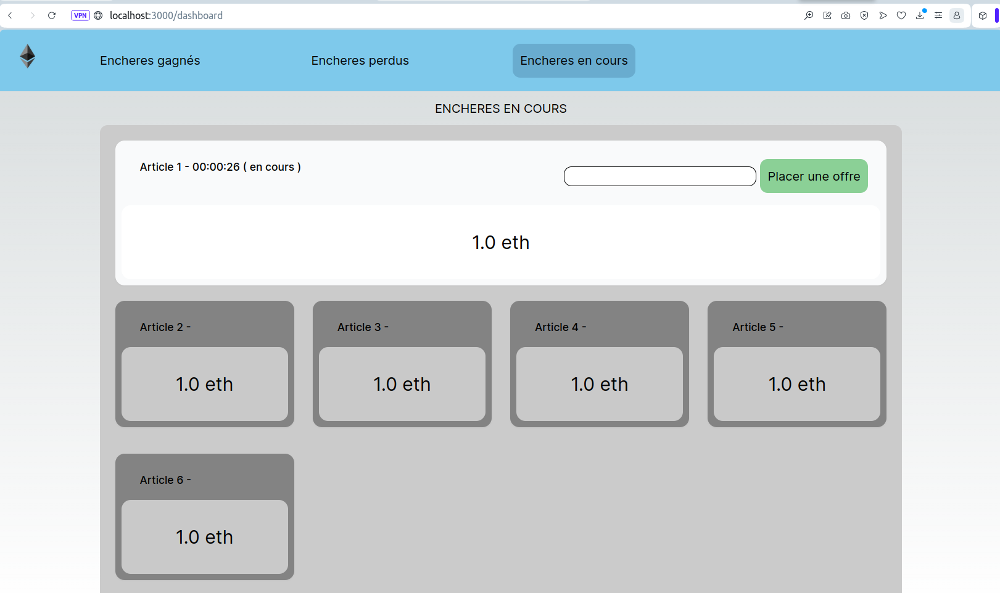


Ici on verra les articles en cours dans l'ènchere avec un le temps écoulé depuis que l'article est disponible, le prix descends chaque minute, jusqu'à arriver à 0.2 eth.

L'arricle disponible sur le momet, fourni un input où on pourra placcer une offre selon le prix en temps réel affiché dans l'application. C'est à dire que si on essaie d'acheter le produit pour un prix plus bas de ce qui est affiché, on aura un erreur.


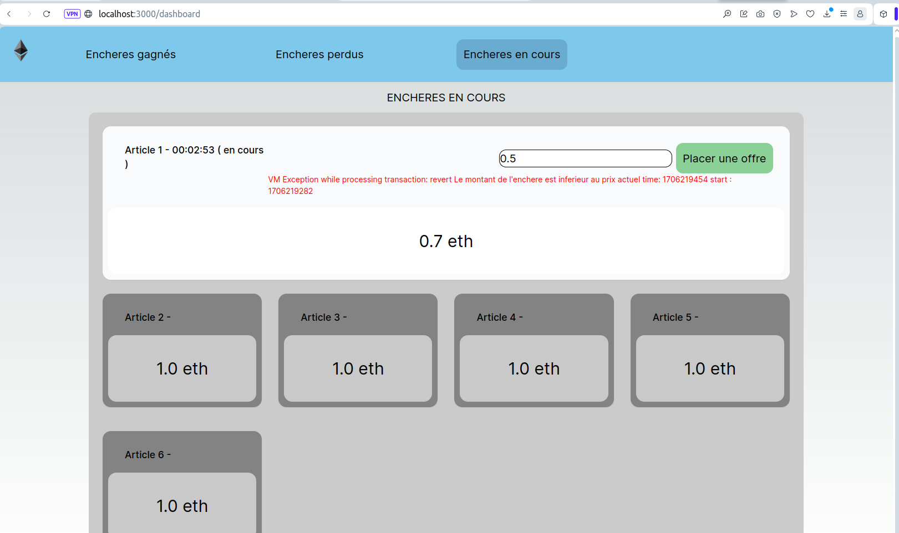


Cependant, si on place une offre égal ou supérieur au prix actuel on aura une confirmation Metamask pour la transaction.

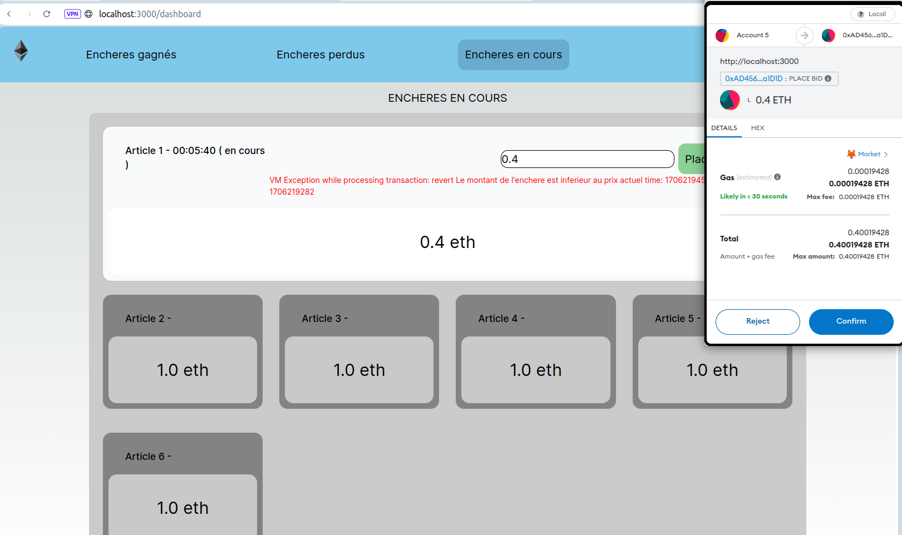


Faire click sur Confirmer et on verra comment l'Article 1 ne figure plus sur la liste des enchères en cours et que l'application est passée à l'article suivant en redemarrant le prix actuel à 1eth

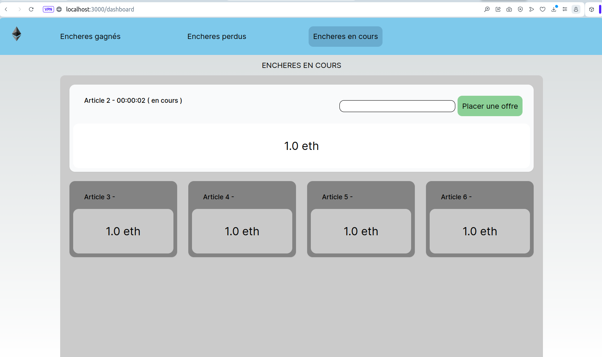

Puis on peut venir sur l'onglet "Encheres gagnés" et on trouvera l'article au'on vient d'acheter et le prix pour lequel on l'a acheté.

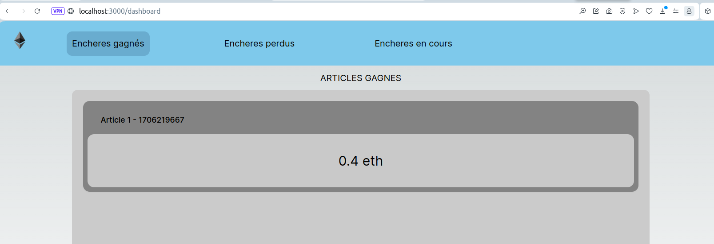

Maintenant revenon sur "Encheres en cours" et changeons de compte sur Metamask.

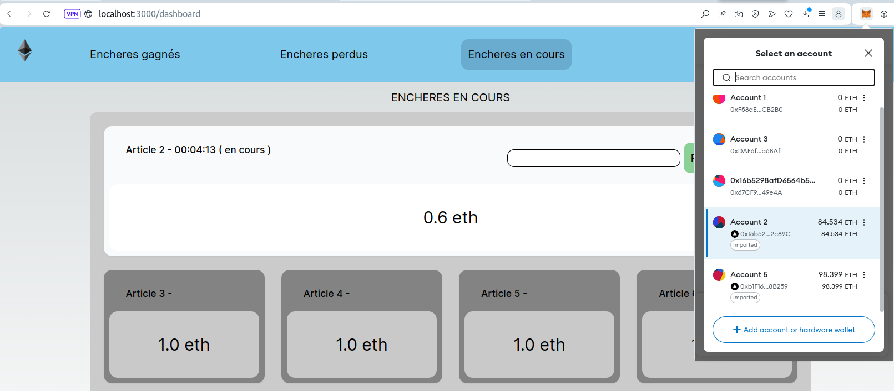

Une fois qu'on est connecté sur un autre compte, acheter l'Article 2 et l'Article 3.

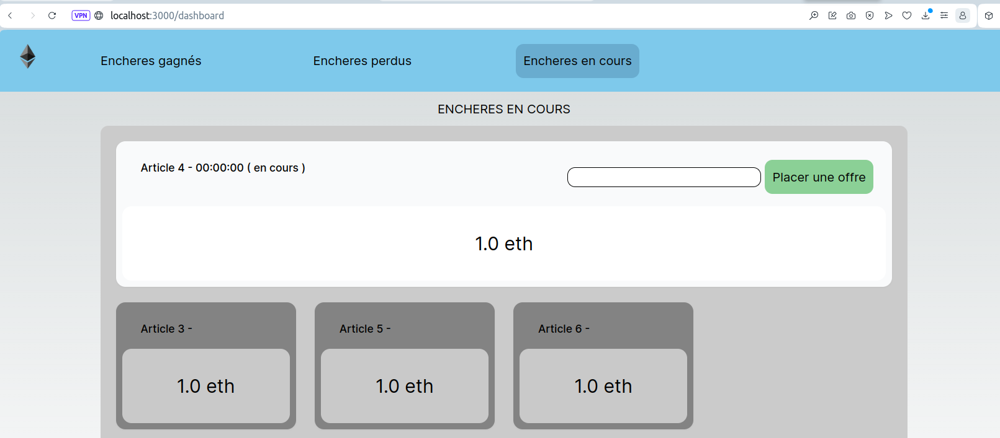

On peut voir que les articles 2 et 3 ne figurent plus dans la list actuelle.

On peut venir sur l'onglés "Encheres gagnés".

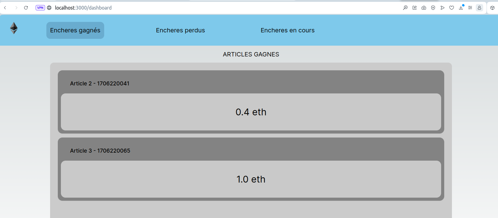

On trouvera les articles 2 et 3 qu'on vient d'acheter.

Puis on vient sur l'onglet "Encheres perdus".

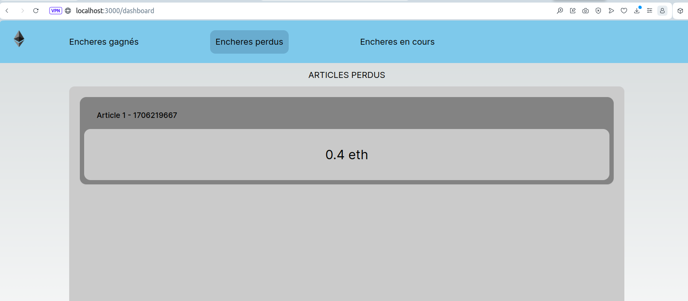

Et on trouvera ici le premier Article qu'on a acheté lors qu'on était connecté sur l'autre compte.

===========================================================


<h6>Developpé par Andoni ALONSO Tort</h6>
<h6>Université du Havre Normandie, France</h6>